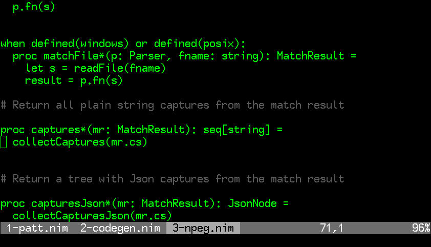

# Introduction

This is a simple script that shows a tabs-like list of buffers in the bottom of
the window. The biggest advantage of this script over various others is that it
does not take any lines away from your terminal, leaving more space for the
document you're editing. The tabs are only visible when you need them - when
you are switching between buffers.



# Usage

This script draws buffer tabs on vim startup, when a new buffer is created
and when switching between buffers.

It might be handy to create a few maps for easy switching of buffers in your
.vimrc file. For example, using F1 and F2 keys:

```
  noremap <f1> :bprev<CR>
  noremap <f2> :bnext<CR>
```

or using control-left and control-right keys:

```
  :noremap <C-left> :bprev<CR>
  :noremap <C-right> :bnext<CR>
```


Some configuration options are available for styling and layout, check the top
of the plugin file for instructions.
 
# Configuration example

This is my personal setup:

```
:let g:buftabs_only_basename=1
:let g:buftabs_in_statusline=1
:let g:buftabs_active_highlight_group="Visual"
:let g:buftabs_marker_start = " "
:let g:buftabs_marker_end = " "   
:let g:buftabs_marker_modified = "!"
                                     
noremap <f1> :bprev<CR>
noremap <f2> :bnext<CR>  
```
